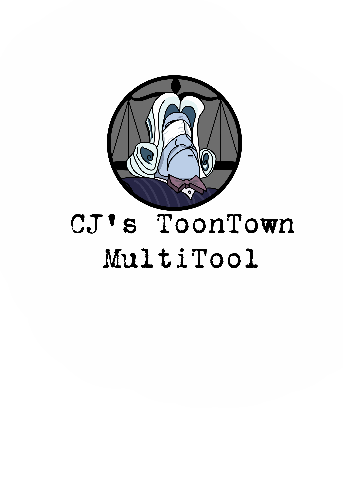

  

A **ToonTown Rewritten** (partial CC support) MultiTool for **Linux and Windows**.

<!-- Hero screenshot goes here. Suggested: top-of-app multitoon tab with
     4 toons enabled, 1200x700 PNG. Drop the file into assets/ and add
     an img tag once available. -->

---

## Table of Contents

- [Table of Contents](#table-of-contents)
- [Install](#install)
- [Usage](#usage)
- [Security](#security)
- [Background](#background)
- [License](#license)

---

## Install

- **Windows (exe)**

    - Navigate to the releases tab on the right side of the screen and click it
    - Find the latest release, labelled Vx.x.x
    - Within that release, find the asset labelled **TTR-MultiTool-x.x.x-win64.zip** and download it
    - Open the zipped archive, and extract the **TTR-MultiTool-x.x.x-win64** folder anywhere on your computer.
    - Locate the **TTR-MultiTool.exe** executable and run it. On first download, Windows SmartScreen may show "Windows protected your PC". This is expected for unsigned installers, click "More info" then "Run anyway".
    - Skim the usage section to ensure you understand how to use the tool (or dont't!)

- **Linux (AppImage)**
  - Navigate to the releases tab on the right side of the screen and click it.
  - Find the latest release, labelled Vx.x.x.
  - Within that release, find the asset labelled **TTR-MultiTool-x.x.x-linux.tar.gz** and download it.
  - Extract the tarball anywhere on your computer, and from within the directory, run: chmod +x TTR_MultiToolx86_64.AppImage
  - Skim the usage section to ensure you understand how to use the tool (or dont't!)

- **Compile from Source**
  - Instructions will be minimal, because if you are compiling from source, I assume you know what you are doing
  - Linux: requires X11 development headers (libx11-dev)
  - Windows: requires MSVC 2022 Build Tools and vcpkg for dependency management
  - This repo was written and tested on Linux Mint, using Neovim and uses C++20
  - Run "git clone https://github.com/phacenet/CJs-ToonTown-MultiTool.git" in a directory of your choosing
  - Ensure you have all of the required dependencies from the Cmake before attempting to compile
  - Requires Qt6, socket.io.client-cpp, libcurl, libsodium, openssl
  - **Note** A patch to socket.io.client-cpp was made, as Cloudflare upgrades the connection to HTTP/2 when it sees HTTP/2 advertised in TLS, but socket.io-client-cpp only knows how to do WebSocket over HTTP/1.1, hence the patch forces HTTP/1.1.
  - websocketpp is incompatible with C++20, so the CMake forces C++17 for the socket.io targets specifically

---

## Usage
- The MultiTool has 6 different "apps" built into it.
    - Launch TTR
    - ToonHQ Auto Group Accept
    - ToonHQ Web Page
    - Dual Toon
    - Doodle Training
    - Invasion Monitor

- **Login**
  - The Tool requires you login with your **ToonHQ** login credentials. Several features are integrated with the ToonHQ website, and require the login information. You can optionally prevent the encrypted storage of your credentials by ticking the
    "Don't store my login information" checkbox on the main page. This setting will be remembered and persist after exiting, until unchecked.

  
  

- **Launch TTR**
    - Launches ToonTown Rewritten from the app. Can store up to **3** different logins at once. All logins are encrypted and stored locally in the config/ToonHQLogin or config/ToontownLogin folders.
    - The program automatically detects common installation paths, and manual input is not necessary unless detection fails,
    - The blue button launches the saved client, the yellow pencil button edits the stored login, the red x button removes the stored client, and the folder icon provides a manual override to the
      automatic installation detection.

  
  

- **ToonHQ Auto Group Accept**
  - A toon is selected from the synced ToonHQ toonlist, and when a group is created in-game, the app will automatically verify that group, and the user need not navigate to the ToonHQ website to accept that group's creation.
  - Only one toon can be connected at a time.
  - *Note: Toons will ONLY appear on the list if they are synced through the ToonHQ website*

  
  

- **ToonHQ Web Page**
  - An embedded ToonHQ webpage. To prevent having to navigate back and forth from the ToonHQ webpage to find groups. Once logged in, the browser will store cookies and remember who you are, preventing the need for repeated logins.

  

- **Dual Toon**
    - Sends keyboard inputs to two separate toons, simultaneously.
    - Only two keyboard schemes are supported: [WASD, SPACE to jump, ENTER to open SpeedChat+] and [ARROW_KEYS, SPACE to jump, ENTER to open SpeedChat+]
    - Simply click the **Select Arrow Keys Toon** and then the window of the toon you wish to send inputs to, then the **Select WASD Toon** and the window you wish to send inputs to.
    - Window focus **DOES NOT** matter. Keyboard inputs are sent regardless if the window has focus.
    - The list of *MIRRORED* inputs are: [DELETE, HOME, END, SPACE, ENTER]
    - *Note: Pressing the enter key will enter chat mode, preventing keyboard inputs from being read. If you experience trouble getting inputs, check the Dual Toon page to make sure you haven't accidentally entered chat mode*
  

    
    
    
  

  - **Doodle Training**
    - A doodle training autoclicker. Requires screen resolution to be set to 800x600 Windowed in the display settings for screen-space coordinates to behave as expected.
    - Usage is similar to the **Dual Toon** page. Click on the trick you want to train, then the window to send mouse inputs to. Once again, the window does **NOT** require focus, and does **NOT** steal mouse focus. You use your computer as usual while the autoclicker does its work.
    - Because trick ordering can be different per toon, there is an optional label beside each trick, which persists after application exit and reopen. It does not have any actual affect on the program execution, it is purely visual.
  

    
    
  

  - **Invasion Monitor**
    - Displays the currently occurring invasion information: District, Cog Type, Cogs defeated/Total Cogs, Estimated Time Remaining.
    - Total number of invasions is displayed in the bottom right hand corner of the screen in bold red text.
    - **IMPORTANT: The entire app can be minimized and steal focus with the hotkey "F1" even without focus. F1 bring the Tool back up over your current tab, and will automatically navigate to the Invasions page.**
  

    
  

---

## Security
- Sensitive credentials, such as the ToonHQ login (if you choose to store it) and your ToonTown login credentials are encrypted using libsodium and **ONLY** stored locally on your device.
- Your login information is stored encrypted in the *config/ToonHQLogin/* AND *config/ToontownLogin/* directories.
- Absolutely no information is shared or sent externally. It is encrypted using crypto_secretbox and EXCLUSIVELY stored on your device. A key is generated at creation, and can only your login credentials can only be unencrypted with that key.
  Any tampering or altering of the key will result in an error and prevent login. If you accidentally modify this, you can simply navigate to the aforementioned folders and delete all .bin files from within them, or simply reinstall the tool.
- If you are curious about how the encryption is done, navigate to the src/usr/encryption.cpp and .hpp files and take a look yourself.

---

## License

[MIT](LICENSE) © phacenet
